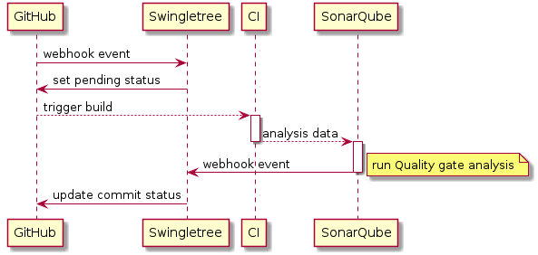
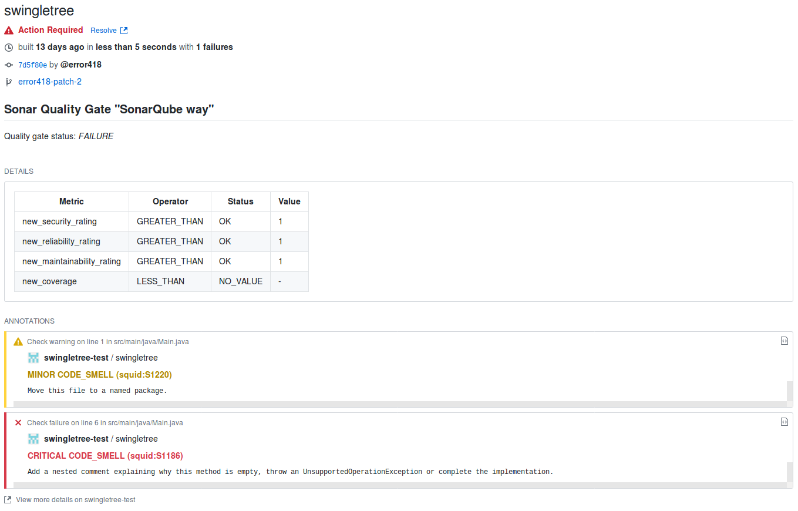

# Swingletree [][code-climate] [][dockerhub-repo]


Enforce SonarQube Quality Gates inside your GitHub Pull Requests.

Tracking your code quality across your branches is a good thing - especially when it comes to approving pull requests.

Swingletree gives you the possibility to block pull requests on failing quality gates performed by the [SonarQube Branch Plugin][sonar-branch-plugin]. The commit status is also updated as soon as findings are marked as, for example, `false-positive` or `won't fix` in SonarQube.

## How does it work?

Swingletree uses [SonarQube webhooks][sonar-webhook]. No need to install and update plugins on your SonarQube instance.



Swingletree integrates itself as a GitHub App, which spares you some configuration work and does not require a technical user. It will use the GitHub checks API to attach SonarQube information to your Pull Requests.

<details><summary>Click to expand Demo screenshots</summary>
<p>

> 

> 

</p>
</details>


# Setting up Swingletree

Follow these steps to set up Swingletree

1. [Install Swingletree](#install-swingletree)
2. [Configure Swingletree](#configure-swingletree)
3. [Configure SonarQube](#configure-sonarqube)
4. [Configure Sonar Scanner](#configure-sonar-scanner)


## Install Swingletree

Swingletree can be run from source or by using Docker.

To be able to run Swingletree following prerequisites must be met:

* NodeJS 8 or later
* Redis 4 or later

Pick one of the following ways to launch Swingletree:

### Running with Docker

Images of Swingletree are built and hosted in the dockerhub repository [werkbank/swingletree][dockerhub-repo]. 

Swingletree comes with an `docker-compose` file, which should mainly be used for development purposes.
Start Swingletree and a Redis database by running `docker-compose up` in the Swingletree directory.

You will still need to configure your Swingletree instance via [environment variables](#environment-variables).

### Building a Docker image

Swingletree is built using a build container. By running `docker build .` you can start building Swingletree along with its container image. In case you need to use a npm registry proxy you can override the default NPM registry by defining the docker build argument `NPM_REGISTRY` (for example `docker build --build-arg NPM_REGISTRY=http://my.npm.registry/` ). Be aware that you will download the npm dependencies for each build.


## Configure Swingletree

Swingletree is configured using a configuration file named `swingletree.conf.yaml` or via environment variables, which are listed and described below.

### Environment Variables

#### GitHub configuration

| Variable              | Description                                                       | Default |
| --------------------- | ----------------------------------------------------------------- | ------- |
| `GH_APP_PEM`          | Contents will be written to `./gh-app.pem` on startup             | *none*  |
| `GITHUB_APPID`        | Configures the GitHub Application ID                              | *none*  |
| `GITHUB_BASE`         | Configures the GitHub API base URL (useful for GitHub Enterprise) | *none*  |
| `GITHUB_SECRET`       | Configures the GitHub webhook secret                              | *none*  |
| `GITHUB_KEY_FILE`     | A path pointing to the GitHub App private key file                | *none*  |
| `GITHUB_APP_PAGE`     | *(optional)* Points to the GitHub App public page. The value can be found on the GitHub App configuration page. | *none* |

#### Sonar configuration

| Variable              | Description                                                       | Default |
| --------------------- | ----------------------------------------------------------------- | ------- |
| `SONAR_SECRET`        | Enables and sets the Basic Authentication password for the Swingletree SonarQube webhook. | *none* |
| `SONAR_BASE`          | SonarQube base url (for example `http://sonarhost:9000`)          | *none*  |
| `SONAR_TOKEN`         | SonarQube API token                                               | *none*  |

#### Database configuration

| Variable              | Description                                                       | Default |
| --------------------- | ----------------------------------------------------------------- | ------- |
| `DATABASE_HOST`       | Sets the Redis database host                                      | *none*  |
| `DATABASE_PASSWORD`   | Sets the Redis database password to use for authentication        | *none*  |

#### Application configuration

| Variable              | Description                                                       | Default |
| --------------------- | ----------------------------------------------------------------- | ------- |
| `PORT`                | Sets the port Swingletree is listening on.                        | `3000`  |
| `LOG_LEVEL`           | Sets the log level.                                               | `info`  |
| `LOG_DISABLE_COLORS`  | Disables colors in log messages if set to `true`.                 | `false` |
| `LOG_FORMAT`          | Sets the log format. Can be `json`, `logstash` or `text`          | `text`  |

#### GitHub Enterprise

If you are running GitHub Enterprise be sure to address the API endpoint. Depending on your configuration this could be a subdomain like `https://api.corporategithub.com` or a path `https://corporategithub.com/api/`.

Swingletree is tested against GitHub Enterprise 2.15

### GitHub App Configuration

In case you want to run your own Swingletree you will need to create a GitHub App on Github.com (or your GitHub Enterprise instance). Follow the instructions on this [GitHub Guide][create-gh-app] to create one.

#### GitHub App Private Key

You will notice that a private key file named `gh-app.pem` (by default) is required on startup. Swingletree needs this file to authenticate with GitHub.

After you have created your GitHub App, you can generate and download the key from the App configuration page.

#### Permissions

When creating your GitHub App you will need to specify the permissions required by the App. If the permissions are not granted, Swingletree will not be able to operate properly.

Read and Write access are required for `Checks`


## Configure SonarQube

Swingletree publishes webhook endpoints for SonarQube and events.

| Type      | Path            | Content Type       |            |                          |
| --------- | --------------- | :----------------: | :--------: | ------------------------ |
| SonarQube | webhook/sonar   | *not configurable* | required   | [How-to][sonar-webhook]  |
| GitHub    | webhook/github  | application/json   | required   | Configured in GitHub App |

#### SonarQube Webhook security

Swingletree's SonarQube webhook can be configured to be protected by basic authentication. You can set the secret via environment variable or inside the configuration file. If you do not configure this value, the webhook can be used without providing authentication. Keep in mind you should use `https` (by using for example a reverse proxy) to protect your credentials.

## Configure Sonar Scanner

Swingletree needs some context when receiving webhook events from SonarQube. Therefore some additional analysis properties need to be set when running a `sonar-scanner` during your CI build.

* `sonar.analysis.commitId`, containing the commit id
* `sonar.analysis.repository`, containing the full repository path

You can set the parameters when invoking the `sonar-scanner`. For example:

```
sonar-scanner \
    -Dsonar.analysis.commitId=628f5175ada0d685fd7164baa7c6382c1f25cab4 \
    -Dsonar.analysis.repository=error418/swingletree
```

Of course these values (at least `commitId`) need to be acquired dynamically on each build. Sonar Scanner plugins for Build Management tools like Gradle offer configuration properties to set extra scanner properties:

```groovy
sonarqube {
    properties {
        property "sonar.analysis.commitId", commitId
        property "sonar.analysis.repository", repository
    }
}
```

[code-climate]: https://codeclimate.com/github/error418/swingletree/maintainability
[dockerhub-repo]: https://hub.docker.com/r/werkbank/swingletree/tags/

[create-gh-app]: https://developer.github.com/apps/building-github-apps/creating-a-github-app/
[sonar-webhook]: https://docs.sonarqube.org/display/SONAR/Webhooks
[sonar-branch-plugin]: https://docs.sonarqube.org/display/PLUG/Branch+Plugin
[github-webhook]: https://developer.github.com/webhooks/creating/#setting-up-a-webhook
