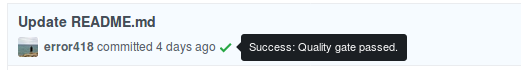

# Swingletree

> Be aware Swingletree is under development. Some edges may be still rough and sharp.

Utilize SonarQube Quality Gates inside your GitHub Pull Requests.


## Intention

Tracking your code quality across you branches is a good thing - especially when it comes to approving pull requests.

Swingletree gives you the possibility to automatically block pull requests on failing quality gates performed by the SonarQube branch plugin.

## Integration

Swingletree integrates into SonarQube using webhooks. No need to install and update plugins on your SonarQube instance.


Swingletree integrates itself as a GitHub App, which spares you some configuration work. You will only need to install Swingletree as a GitHub App on your GitHub organization.

Swingletree will request a permission to modify your repositories' commit statuses.

> 

### SonarQube Analyze Parameters

Swingletree needs some context when receiving webhook events from SonarQube. Therefore some parameters need to be set when running a SonarQube Analysis.

* `sonar.analysis.branch`, containing the name of the branch
* `sonar.analysis.commitId`, containing the commit id
* `sonar.analysis.repository`, containing the full repository path

You can set the parameters when invoking the `sonar-scanner`. For example:

```
sonar-scanner \
    -Dsonar.analysis.branch=dev \
    -Dsonar.analysis.commitId=628f5175ada0d685fd7164baa7c6382c1f25cab4 \
    -Dsonar.analysis.repository=error418/swingletree
```

## Installation

This section covers the prerequisites and the installation of Swingletree. If you want to run Swingletree as a Docker container you can skip to the section [Running with Docker](#running-with-docker) 

### Prerequisites

* NodeJS 8 or later
* A redis database


## Configuration

Swingletree is configured using a configuration file named `swingletree.conf.yaml` or via environment variables when using docker (see [Section Run](#run)).

## Build

Swingletree is built using a build container. By running `docker build .` you can start building Swingletree along with its container image. In case you need to use a npm registry proxy you can override the default NPM registry by defining the docker build argument `NPM_REGISTRY` (for example `docker build --build-arg NPM_REGISTRY=http://my.npm.registry/` ). Be aware that you will download the npm dependencies for each build.

If you don't want to get all that fancy and just want to build Swingletree without its image you can still run a plain `npm run build`.

## Run

Swingletree can be run from source or by using Docker.

### Running with Docker

Start Swingletree and a Redis database by running

```
docker-compose up
```

#### Environment Variables

| Variable      | Description    |
| ------------- | -------------  |
| GH_APP_PEM    | Variable contents will be written to `./gh-app.pem` on startup  |
| CONFIG        | If set the variable contents will be written to `./swingletree.conf.yaml` on startup. This needs to be a plain string.  |


### Running from source

Start swingletree by installing your dependencies with `npm i --production` and run the application by `npm start` 