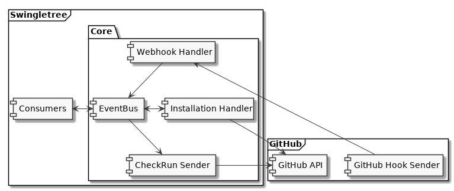
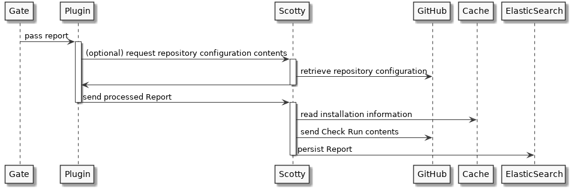

### Architecture

Swingletree is divided into components, which communicate via an Event Bus.

#### Scotty

The Scotty component handles interactions with GitHub and ElasticSearch.

* GitHub App installation management
* Authentication with GitHub
* Provide GitHub API access
* Token caching
* ElasticSearch persistence management

#### Gate

Gate functions as an entrypoint for requests, authenticating and routing to the underlying services.

#### Deck

Deck provides the Swingletree UI

#### Plugins

Plugins are implemented as services, which are registered to Gate. They are invoked using ReST, process the provided report and POST the results to Scotty.