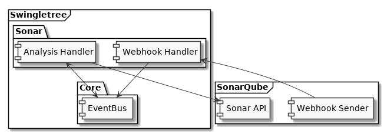

### Architecture

Swingletree is divided into components, which communicate via an Event Bus.

#### Core Component

The Core component handles interactions with GitHub.

* GitHub App installation management
* Authentication with GitHub
* Provide GitHub API access
* Token caching
* Template Engine
* GitHub Webhook event propagation to Event Bus

#### SonarQube Component

The SonarQube component handles interactions with SonarQube

* Query SonarQube API
* Calculate metrics related to SonarQube
* Provide Sonar Webhook endpoint
* Construct GitHub CheckRuns

